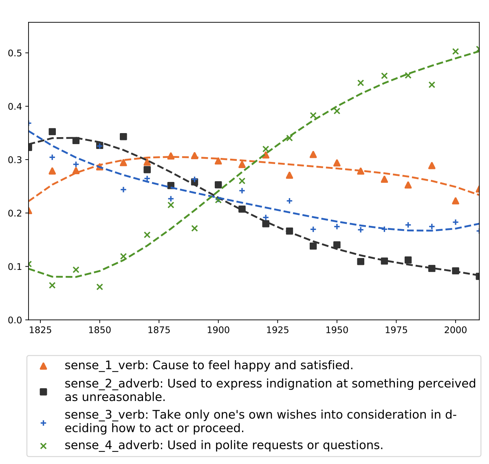

# Diachronic Sense Modeling with Deep Contextualized Word Embeddings

This repos is an implementation of the official paper 
'Diachronic Sense Modeling with Deep Contextualized Word Embeddings'

Renfen Hu, Shen Li and Shichen Liang. Diachronic Sense Modeling with Deep Contextualized Word Embeddings: An Ecological View, ACL 2019



We tried to recreate the whole process explained in the paper with Newspaper data.
The different data periods are: ``` 1980, 1985, 1990, 1995, 2000, 2005, 2010, 2015 ```

